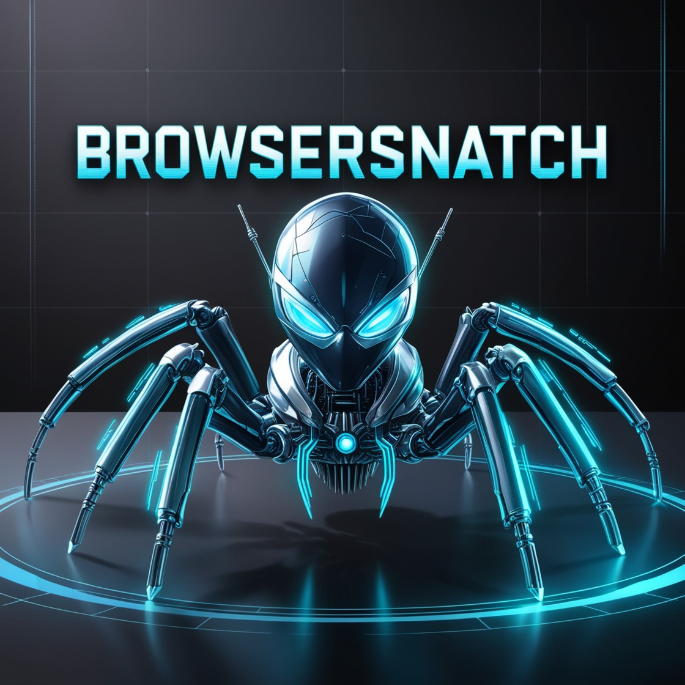

## BrowserSnatch
----------------------------------------------------

<div align="center">
  
</div>

### A Versatile Browser Data Extraction Tool

BrowserSnatch is a powerful and versatile tool designed to **"snatch"** sensitive data from a variety of web browsers. This tool targets both Chromium-based browsers (such as Edge, Chrome, Opera, etc.) and Gecko-based browsers (such as Firefox, Thunderbird, etc.) overall including more than **40 browsers**, making it a comprehensive solution for browser data extraction.

--------------------------------------------------
### 💌 Buy Me A Coffee
<a href="https://paypal.me/shaddy43">
  
</a>

--------------------------------------------------

### 🚀 Capabilities
- **Snatch Latest App-Bound Encrypted data**: Extract and decrypt latest app-bound encrypted data (chrome, edge, brave)
- **Snatch Saved Passwords**: Effortlessly retrieve stored passwords from all major Chromium and Gecko-based browsers
- **Snatch Cookies**: Extract cookies from user profiles across multiple browsers
- **Snatch Bookmarks**: Snatch all saved bookmarks from every browser
- **Snatch History**: Now supports snatching of history across all browsers
- **Super Fast**: Written in c/c++ with very fast performance
- **Easy to Use**: No complicated setup or configuration required
- **Zero External Dependencies**: Completely written in c/c++, with little to no need for additional libraries
- **Cross-Browser Support**: Handles both Chromium and Gecko-based browsers with ease
- **Greed Mode**: Greed mode included which snatches everything in a single stealer db

--------------------------------------------------

### ⚠️ Disclaimer

BrowserSnatch is a tool designed for legal, ethical penetration testing and educational purposes only. The author is NOT responsible for any misuse or illegal activities performed using this tool. Always ensure you have proper authorization before testing any system or network.

--------------------------------------------------

### 📜 Code of Conduct

By using BrowserSnatch, you agree to:

- Use this tool in compliance with all local, state, and federal laws
- Obtain proper authorization before testing any system or network
- Respect privacy and confidentiality when handling data

--------------------------------------------------

### 🛠️ Build
- Clone the repository
- Open in Visual Studio
- ISO C++17 Standard (/std:c++17) or higher
- Include missing packages (eg; nlohmann) using Visual Studio NuGet installer
- Compile

--------------------------------------------------

### 🛠️ Usage
To run BrowserSnatch, simply execute the binary from the command line. The tool will operate in default mode if no parameter is provided.

**Default Mode**
- No Parameter Provided: Executes with default settings and attempts to snatch all saved passwords and cookies

**CommandLine Mode**
- Parameter: -h: Displays a help menu detailing all available options.

  **Password Snatching**
    - Parameter: -pass: Snatch passwords from every browser.
    - Parameter: -pass -c: Snatch passwords from Chromium-based browsers only.
    - Parameter: -pass -g: Snatch passwords from Gecko-based browsers only.

  **Cookie Snatching**
    - Parameter: -cookies: Snatch cookies from every browser.
    - Parameter: -cookies -c: Snatch cookies from Chromium-based browsers only.
    - Parameter: -cookies -g: Snatch cookies from Gecko-based browsers only.
    - Parameter: -app-bound-decryption: Snatch cookies from latest v20 app bound encryption only (requires admin)

  **Bookmarks Snatching**
    - Parameter: -bookmarks: Snatch bookmarks from every browser.
    - Parameter: -bookmarks -c: Snatch bookmarks from Chromium-based browsers only.
    - Parameter: -bookmarks -g: Snatch bookmarks from Gecko-based browsers only.

  **History Snatching**
    - Parameter: -history: Snatch history from every browser.
    - Parameter: -history -c: Snatch history from Chromium-based browsers only.
    - Parameter: -history -g: Snatch history from Gecko-based browsers only.

  **Greed Mode**
    - Parameter: -greed: Snatch everything from every browser and save in a single stealer database.

  **NOTE**
    - If fails to snatch cookies or passwords, RUN -app-bound-decryption mode first.
    - If still fails, run -recalibrate mode.

<!--  -->
<p align="center">
  
</p>

#### 📝 Example
- Run the following command to start BrowserSnatch in default mode:
```sh
./BrowserSnatch
```

- To see the user-friendly console interface, use:
```sh
./BrowserSnatch -console-mode
```

- To see help menu, use:
```sh
./BrowserSnatch -h
```

- To Snatch all browser passwords, use:
```sh
./BrowserSnatch -pass
```

- To Snatch all browser cookies, use:
```sh
./BrowserSnatch -cookies
```

- To Snatch chrome **v20 app-bound encrypted** browser cookies, use:
```sh
./BrowserSnatch -app-bound-decryption
```

- To Snatch all browser bookmarks, use:
```sh
./BrowserSnatch -bookmarks
```

- To Snatch all browser history, use:
```sh
./BrowserSnatch -history
```

- To Snatch Everything from Every Browser, use Greed mode:
```sh
./BrowserSnatch -greed
```

--------------------------------------------------

### DEMO
Following GIF demonstrates the working of BrowserSnatch and how its stealer log can be accessed.


--------------------------------------------------

### Supported Browser Snatch:

| № | Browser Name | Passwords | Cookies | Bookmarks | History | v20 Cookie Decryption (App-Bound) |
| --- | --- | --- | --- | --- | --- | --- |
| 1 | Chrome | &#9989; | &#9989; | &#9989; | &#9989; | &#9989; |
| 2 | Microsoft Edge | &#9989; | &#9989; | &#9989; | &#9989; | &#9989; |
| 3 | Chromium | &#9989; | &#9989; | &#9989; | &#9989; | &#10134; |
| 4 | Brave - Browser | &#9989; | &#9989; | &#9989; | &#9989; | &#9989; |
| 5 | Epic Privacy Browser | &#9989; | &#9989; | &#9989; | &#9989; | &#10134; |
| 6 | Amigo | &#9989; | &#9989; | &#9989; | &#9989; | &#10134; |
| 7 | Vivaldi | &#9989; | &#9989; | &#9989; | &#9989; | &#10134; |
| 8 | Orbitum | &#9989; | &#9989; | &#9989; | &#9989; | &#10134;|
| 9 | SeaMonkey | &#9989; | &#9989; | &#9989; | &#9989; | &#10134; |
| 10 | Kometa | &#9989; | &#9989; | &#9989; | &#9989; | &#10134; |
| 11 | Comodo Dragon | &#9989; | &#9989; | &#9989; | &#9989; | &#10134; |
| 12 | Torch | &#9989; | &#9989; | &#9989; | &#9989; | &#10134; |
| 13 | Icecat | &#9989; | &#9989; | &#9989; | &#9989; | &#10134; |
| 14 | Postbox | &#9989; | &#9989; | &#9989; | &#9989; | &#10134; |
| 15 | Flock Browser | &#9989; | &#9989; | &#9989; | &#9989; | &#10134; |
| 16 | K - Melon | &#9989; | &#9989; | &#9989; | &#9989; | &#10134; |
| 17 | Sputnik | &#9989; | &#9989; | &#9989; | &#9989; | &#10134; |
| 18 | CocCoc Browser | &#9989; | &#9989; | &#9989; | &#9989; | &#10134; |
| 19 | Uran | &#9989; | &#9989; | &#9989; | &#9989; | &#10134; |
| 20 | Yandex | &#9989; | &#9989; | &#9989; | &#9989; | &#10134; |
| 21 | Firefox | &#9989; | &#9989; | &#9989; | &#9989; | &#10134; |
| 22 | Waterfox | &#9989; | &#9989; | &#9989; | &#9989; | &#10134; |
| 23 | Cyberfox | &#9989; | &#9989; | &#9989; | &#9989; | &#10134; |
| 24 | Thunderbird | &#9989; | &#9989; | &#9989; | &#9989; | &#10134; |
| 25 | IceDragon | &#9989; | &#9989; | &#9989; | &#9989; | &#10134; |
| 26 | BlackHawk | &#9989; | &#9989; | &#9989; | &#9989; | &#10134; |
| 27 | Pale Moon | &#9989; | &#9989; | &#9989; | &#9989; | &#10134; |
| 28 | Opera | &#9989; | &#9989; | &#9989; | &#9989; | &#10134; |
| 29 | Iridium | &#9989; | &#9989; | &#9989; | &#9989; | &#10134; |
| 30 | CentBrowser | &#9989; | &#9989; | &#9989; | &#9989; | &#10134; |
| 31 | Chedot | &#9989; | &#9989; | &#9989; | &#9989; | &#10134; |
| 32 | liebao | &#9989; | &#9989; | &#9989; | &#9989; | &#10134; |
| 33 | 7Star | &#9989; | &#9989; | &#9989; | &#9989; | &#10134; |
| 34 | ChromePlus | &#9989; | &#9989; | &#9989; | &#9989; | &#10134; |
| 35 | Citrio | &#9989; | &#9989; | &#9989; | &#9989; | &#10134; |
| 36 | 360Chrome - Chrome | &#9989; | &#9989; | &#9989; | &#9989; | &#10134; |
| 37 | Elements Browser | &#9989; | &#9989; | &#9989; | &#9989; | &#10134; |
| 38 | Sleipnir5 | &#9989; | &#9989; | &#9989; | &#9989; | &#10134; |
| 39 | ChromiumViewer | &#9989; | &#9989; | &#9989; | &#9989; | &#10134; |
| 40 | QIP Surf | &#9989; | &#9989; | &#9989; | &#9989; | &#10134; |
| 41 | Coowon| &#9989; | &#9989; | &#9989; | &#9989; | &#10134; |

--------------------------------------------------

### 🔄 Future Updates
- **Stability**: More stable tool
- **Less Noise**: Better with leaving residue on systems

Stay tuned for future releases!

--------------------------------------------------

### 📧 Contact
For any inquiries or contributions, feel free to reach out to the [author](https://shaddy43.github.io) or contribute directly via GitHub Issues.

--------------------------------------------------

### 🙏 Acknowledgments
- Inspiration from Project by **SaulBerrenson** called [**BrowserStealer**](https://github.com/SaulBerrenson/BrowserStealer).
- Chrome key & password decryption from [**0x00sec**](https://0x00sec.org/t/malware-development-1-password-stealers-chrome/33571).
- App-Bound encryption key PoC [**snovvcrash**](https://gist.github.com/snovvcrash/caded55a318bbefcb6cc9ee30e82f824).
- Other browser support [**xaitax**](https://github.com/xaitax/Chrome-App-Bound-Encryption-Decryption).
